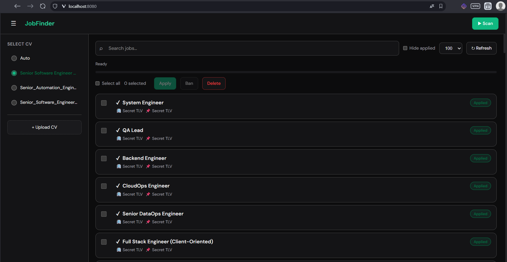

# JF — Job Finder

Job scraping and aggregation service: scrapes job boards and company career pages, stores jobs in SQLite, and exposes a web UI with search, filters, and apply workflows. Optional Prometheus metrics, Chromedp-based scraping, and email (IMAP/Gmail) integration.

[](https://github.com/compfaculty/jf/actions)
[](https://codecov.io/gh/compfaculty/jf)
[](https://goreportcard.com/report/github.com/compfaculty/jf)



## Build and run

**Requirements:** Go 1.22+

```bash
# Build
go build -o jf-server ./cmd/server

# Run (uses config.yaml and data/jobs.db in current directory)
./jf-server

# Flags
./jf-server -version   # print version and exit
./jf-server -help      # print usage
./jf-server -v         # verbose logging
```

**Docker:**

```bash
docker build -t jf-server .
docker run -p 8080:8080 -v $(pwd)/data:/srv/data -v $(pwd)/config.yaml:/srv/config.yaml jf-server
```

Default HTTP address: `:8080`. Config file: `config.yaml` at project root (or `/srv/config.yaml` in Docker). Data directory: `data/` (SQLite DB and optional files).

## Deployment

See [tf/README.md](tf/README.md) for Terraform-based deployment to AWS (ECS Fargate, ECR, ALB, EFS).

## License

See repository license file.
